# Pulse

Your system's vitals, in a flash. صحة جهازك بنظرة واحدة.

Pulse is a small, local-only system monitor (no network use) with one native app per platform: macOS, Windows 11, Linux (GNOME), ChromeOS, Windows XP and Windows 98 SE. A tray or menu bar readout opens a 420px panel with CPU, memory, energy, thermal, GPU, storage, network and top apps, each with a 10-minute history.

## Screenshots

From the design page (`build/prototype`), in English and Arabic.

| Platform | English | العربية |
|---|---|---|
| **macOS** | 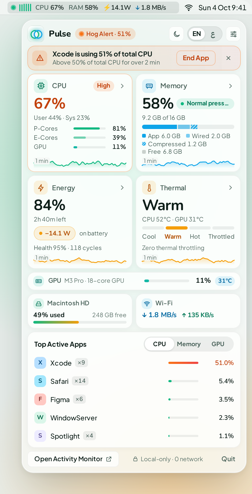 | 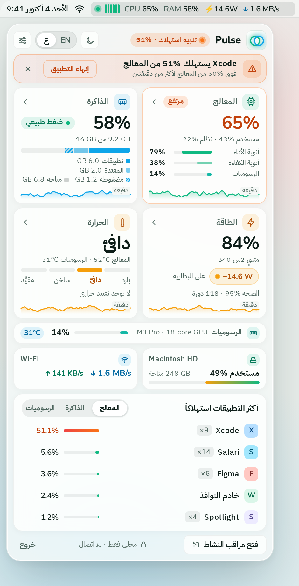 |
| **Windows 11** | 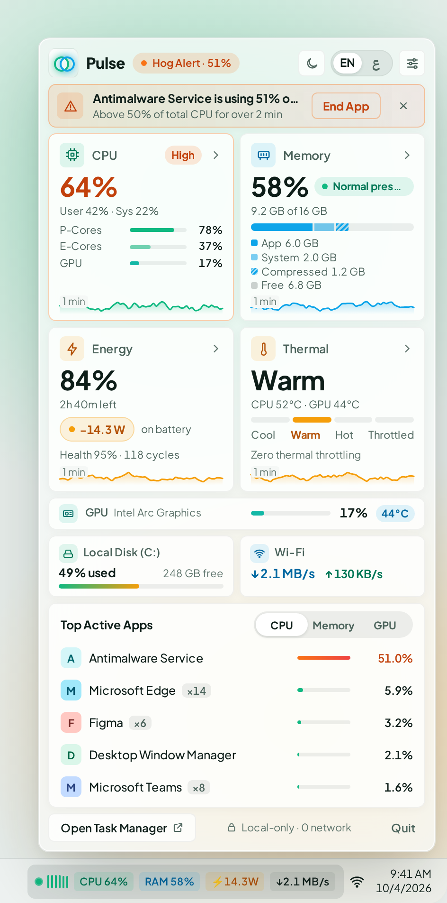 | 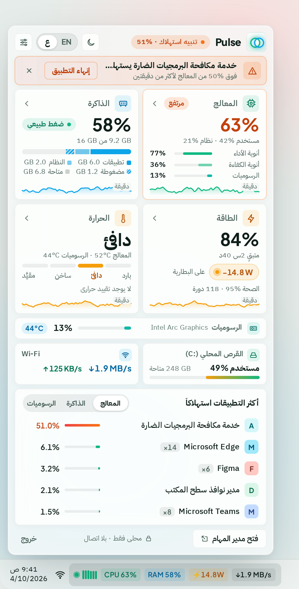 |
| **Linux (GNOME)** | 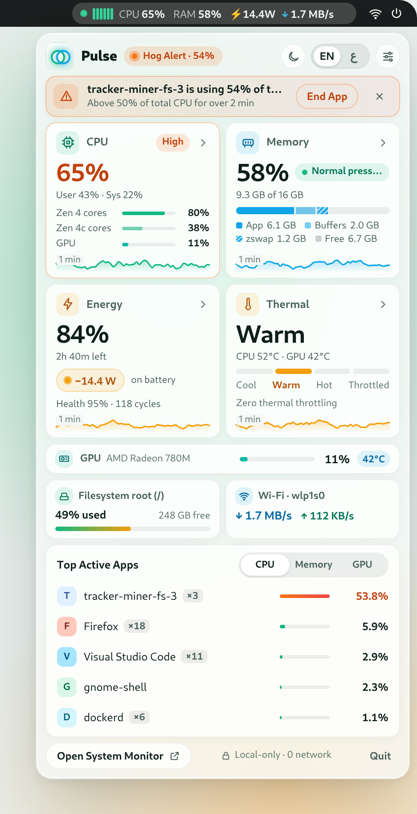 | 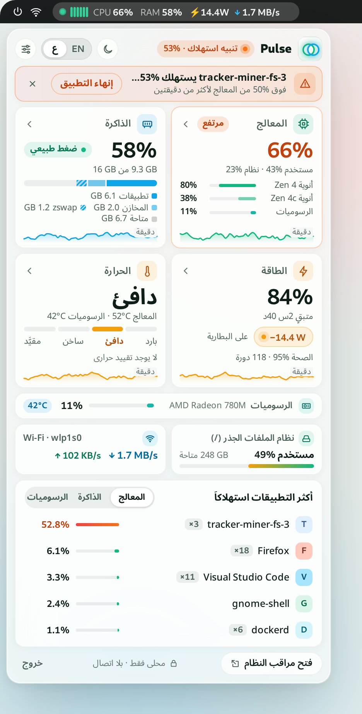 |
| **ChromeOS** | 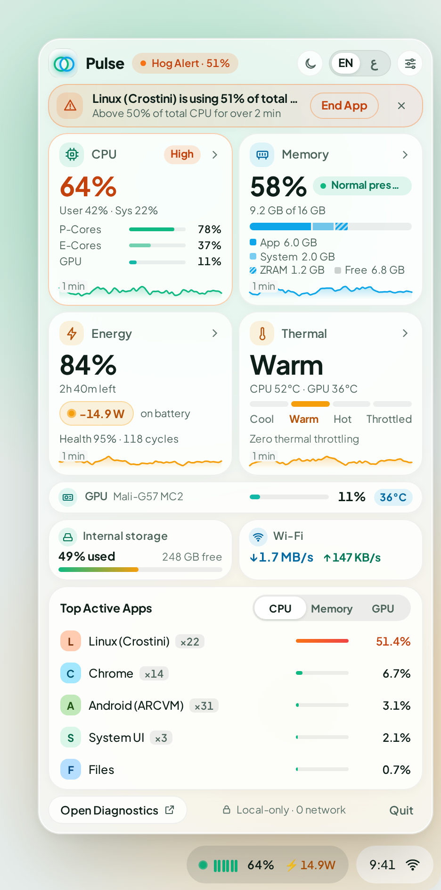 | 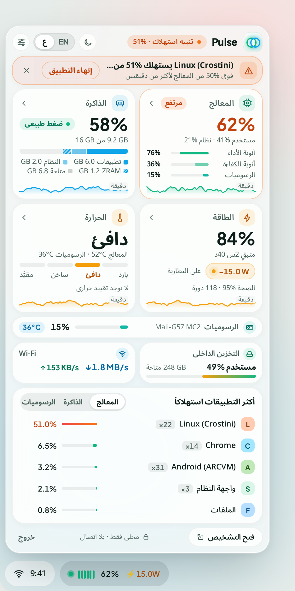 |
| **Windows XP** | 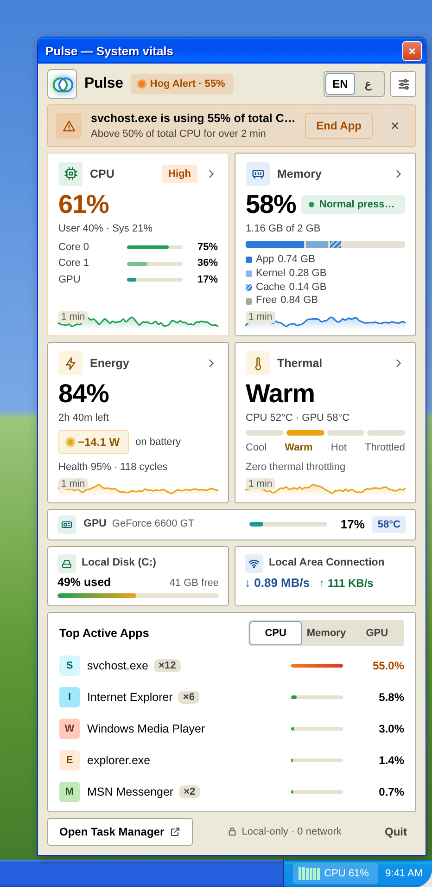 | 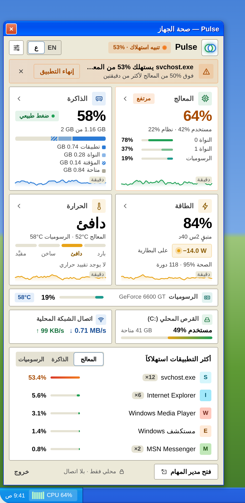 |
| **Windows 98 SE** | 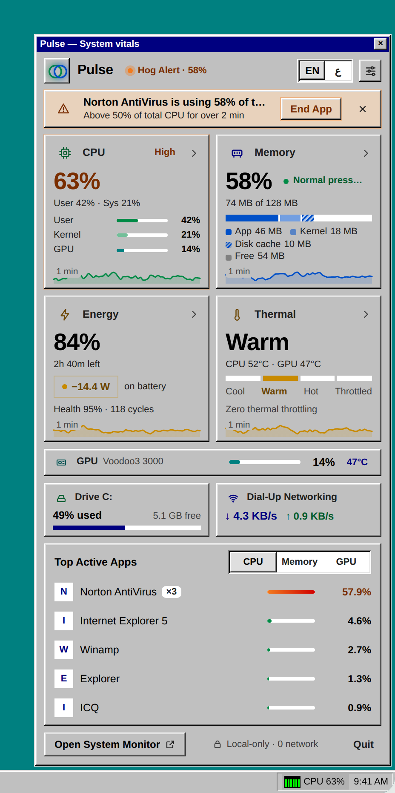 | 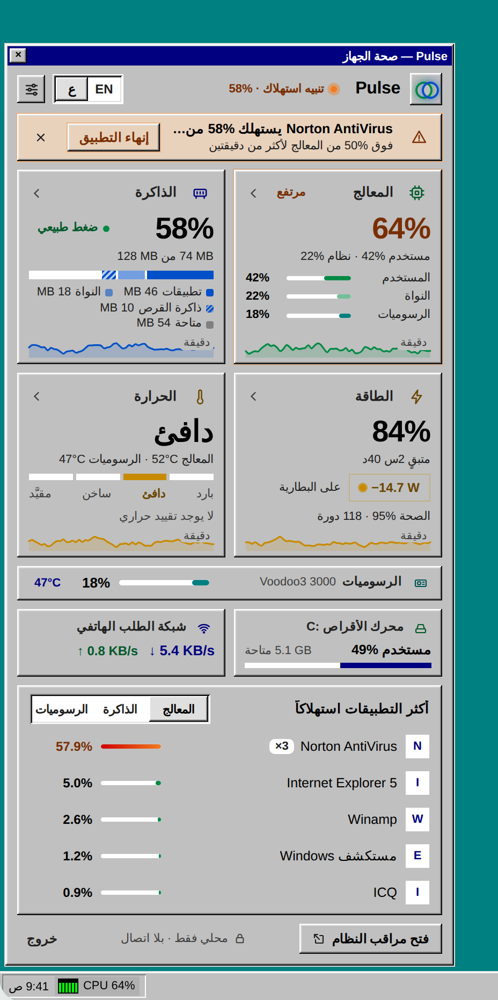 |

## Download

Ready-to-run apps live in `build/`, one folder per platform:

| Folder | What is in it |
|---|---|
| `build/macos/` | `Pulse.app` (zip), built by GitHub Actions on macOS |
| `build/windows-11/` | `Pulse.exe` for x64 and ARM64, built by GitHub Actions on Windows |
| `build/linux/` | `pulse`, one binary (needs GTK 4 and libadwaita) |
| `build/windows-xp/` | `pulse.exe`, 32-bit, runs on XP SP2 and later |
| `build/windows-98/` | `pulse98.exe`, 32-bit, runs on Windows 98 SE and later |
| `build/chromeos/` | A preview of the ChromeOS screen with sample data; the real app ships inside a ChromeOS build (see the README there) |
| `build/prototype/` | The interactive design page that shows all six platforms |

Each folder's README says how to run it.

## Languages

Pulse ships in English and Arabic, with right-to-left layout for Arabic. Pick a language in **Settings > Language**, or with the `EN | ع` switch in the header. **Match system** follows your computer's language.

**Add a language:** add one file to `locales/`. See [TRANSLATING.md](TRANSLATING.md). Every app picks it up on its next build, with no code changes.

## Source

```
locales/       one file per language (the only place app text lives)
i18n/          shared language engine, checks and tests
native/        one app per platform (see native/README.md)
prototype/     source of the design page
build/         ready-to-run apps
docs/          screenshots
.github/       builds and checks that run on every push
```

`AUDIT.md` lists what changed against the first design and what is still open.

## Build from source

Each app's README under `native/` gives its build steps. In short:

```
cd native/linux && cargo build --release          # Linux
cd native/winxp && sh build.sh                    # Windows XP (MinGW)
cd native/win98 && make                           # Windows 98 (MinGW)
cd native/macos && bash scripts/build-app.sh      # macOS (Xcode 15+)
cd native/win11 && dotnet publish src/Pulse.App/Pulse.App.csproj -c Release -p:Platform=x64 -r win-x64 -o publish/x64   # Windows 11
python3 prototype/build.py                        # design page
```

## Tests

```
node i18n/validate.js && node i18n/test/test.js
```
